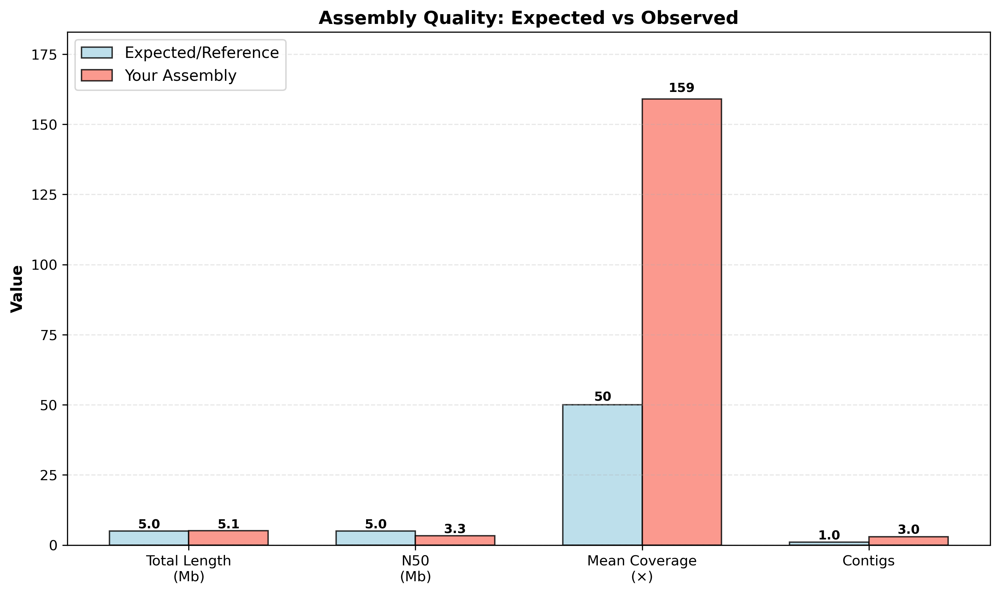
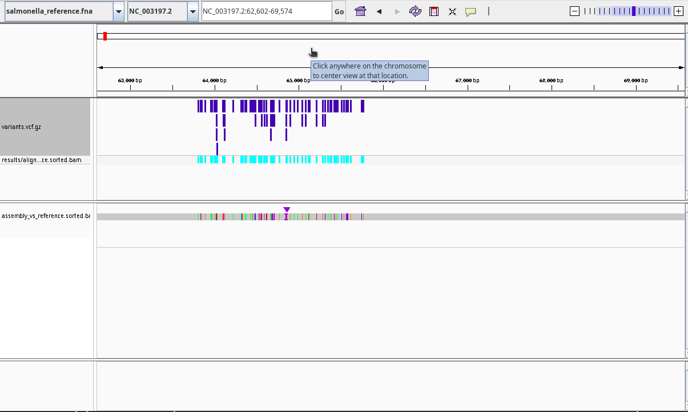
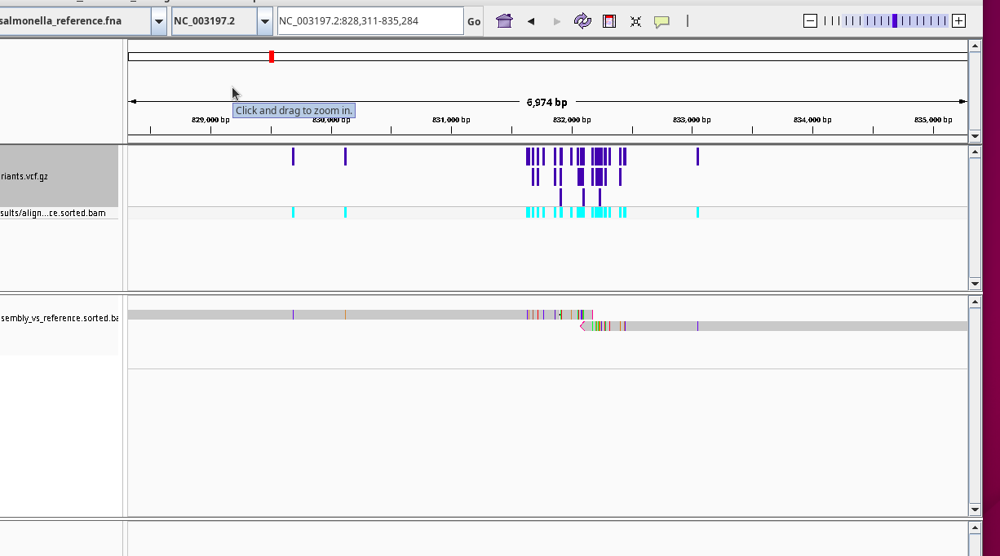
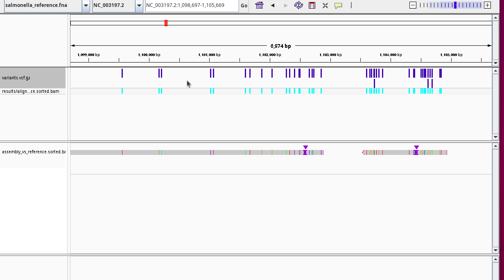

# Assignment 1: Part 1
### Introduction: Biological and Analytical Background
The primary goal of genome assembly and reference-based alignment is to reconstruct an accurate and contiguous representation of an organism’s genome that enables reliable identification of genetic variation. In bacterial pathogens such as Salmonella enterica, whole-genome sequencing (WGS) provides the resolution required to detect variation at the single-nucleotide, gene, and structural levels, supporting applications including comparative genomics, phylogenetic inference, and antimicrobial resistance surveillance (McDermott et al., 2016). A high-quality assembly is essential for these analyses, as fragmentation or sequence inaccuracies can obscure biologically meaningful differences when genomes are aligned to reference sequences. Consequently, genome assembly is not merely a preprocessing step, but a foundational analytical stage that directly influences the accuracy of reference-based comparisons and downstream interpretation.

Multiple assembly strategies have been developed to address these goals, each involving distinct trade-offs between contiguity, accuracy, and computational complexity. Short-read sequencing approaches offer high per-base accuracy but often produce fragmented assemblies due to limited read length, particularly in repetitive regions and plasmids (Taylor et al., 2019). In contrast, long-read sequencing technologies such as Oxford Nanopore sequencing generate reads capable of spanning complex genomic regions, enabling assemblies that approach complete bacterial chromosomes (Xu et al., 2020). However, these advantages are offset by higher raw error rates, especially insertion–deletion errors in homopolymeric regions, which can propagate into assemblies and affect reference-aligned variant detection (Xu et al., 2020; McDermott et al., 2016). Benchmarking studies have further demonstrated that assembly outcomes are sensitive to the choice of assembly algorithm and parameter settings, with statistically significant differences observed among long-read assemblers in sequence accuracy and variant-level metrics, even when overall biological conclusions remain similar (Chen et al., 2020).

In addition to sequencing technology, genome assembly approaches differ in whether genomes are reconstructed de novo or guided by an existing reference. De novo assembly avoids reference bias and enables discovery of novel genomic content but is highly sensitive to sequencing depth and coverage uniformity and may fail to recover complete genomes in low-abundance or heterogeneous datasets despite long-read data (Gauthier et al., 2025). In contrast, reference-guided assembly leverages prior genomic knowledge to improve sensitivity and completeness when a closely related reference is available, although this approach introduces the risk of reference bias. Together, these trade-offs emphasize that assembly strategy selection is context-dependent and must be aligned with the biological question and downstream analytical goal. Overall, these approaches differ in their ability to balance assembly contiguity, base-level accuracy, sensitivity to low-coverage regions, and susceptibility to reference bias, highlighting that no single method is universally optimal.

Given the availability of Oxford Nanopore long-read data, a long-read–based assembly strategy is commonly used for genome reconstruction. (Xu et al., 2020; Taylor et al., 2019). Such an approach is expected to improve assembly contiguity and enable resolution of repetitive genomic regions compared to short-read–only methods (Taylor et al., 2019); however, it also introduces challenges related to higher sequencing error rates and parameter sensitivity, particularly for consensus polishing and variant detection (Xu et al., 2020; Chen et al., 2020). Parameters governing read filtering, assembly stringency, and polishing depth can influence the balance between contiguity and base-level accuracy, underscoring the need for careful evaluation of these choices in downstream analyses (Chen et al., 2020).

## Methods
#### Sequencing Data and Quality Assessment
Raw Oxford Nanopore sequencing reads (FASTQ format) were obtained using R10.4.1 chemistry with super-accurate (SUP) basecalling, producing reads with expected quality scores of Q20+ and an N50 of 5–15 kb. The sequencing data consisted of [196,031 reads totaling 0.081 Gb] for Salmonella enterica. Read quality and length distributions were assessed using NanoPlot v1.43.0 (De Coster et al., 2018), which indicated a mean read length of 4.13 kb, a median read length of 3.96 kb, an N50 of 4.68 kb, and a median quality score of Q23.7 (mean Q18.9).

#### Read Filtering and Quality Assessment
Raw Oxford Nanopore sequencing reads were evaluated using NanoPlot v1.43.0. The dataset contained 196,031 reads totaling 809.3 Mb, with a mean read length of 4.13 kb, N50 of 4.68 kb, mean quality score of 18.9, and median quality score of 23.7.

Quality-based filtering was performed using Filtlong to preferentially retain longer, higher-quality reads. Following filtering, the dataset consisted of 194,034 reads totaling 808.1 Mb, with a mean read length of 4.17 kb and N50 of 4.69 kb. Mean and median quality scores remained unchanged (18.9 and 23.7, respectively).

Filtering resulted in only minor differences in read count and length distribution, indicating that the SUP basecalling chemistry had already produced high-quality reads. Despite the minimal quantitative impact, the filtered dataset was used for downstream assembly and variant analysis to ensure conservative data preprocessing.

#### De Novo Genome Assembly
De novo assembly of the Salmonella enterica genome was performed using Flye v2.9 (Kolmogorov et al., 2019), a long-read assembler optimized for Oxford Nanopore data. Flye was executed with the `--nano-hq` parameter to reflect the high-accuracy R10 chemistry, with an expected genome size of 5 Mb (`--genome-size 5m`) and a minimum overlap length of 1,000 bp (`--min-overlap 1000`). Assembly was performed using 8 threads for computational efficiency. The `--nano-hq` preset was selected based on the Q20+ accuracy profile of the input reads, which enables more stringent error correction compared to standard Nanopore modes.

```bash
flye \
  --nano-hq salmonella_filtered.fastq \
  --genome-size 5m \
  --min-overlap 1000 \
  --threads 4 \
  --out-dir results/assembly
```
#### Assembly Polishing and Quality Evaluation
The draft assembly generated by Flye was polished using Medaka v1.11.3 (Oxford Nanopore Technologies, 2020), which implements a neural network–based consensus correction algorithm trained on Oxford Nanopore error profiles. Polishing was performed using the `r1041_e82_400bps_sup_v4.2.0` model, corresponding to R10.4.1 pore chemistry with super-accurate (SUP) basecalling.

This polishing step corrects systematic sequencing errors characteristic of Oxford Nanopore reads, particularly insertion–deletion errors in homopolymeric regions, thereby improving base-level accuracy and reducing false variant calls in downstream analyses.

```bash
medaka_consensus \
  -i salmonella_filtered.fastq \
  -d results/assembly/assembly.fasta \
  -o results/polishing \
  -m r1041_e82_400bps_sup_v4.2.0 \
  -t 8
```
Assembly quality was intended to be evaluated using QUAST v5.2.0 (Gurevich et al., 2013) in reference-based mode. However, due to software dependency conflicts within the local environment, QUAST could not be successfully installed and executed.

In lieu of QUAST-based evaluation, assembly quality was assessed indirectly through:

- Successful reference-based alignment of the polished assembly
- High mapping rates of reads back to the assembly
- Coverage uniformity across the reference genome
- Downstream variant calling consistency
These indicators collectively suggest that the assembly was structurally coherent and suitable for comparative genomic and variant-level analyses.

```bash
quast.py \
  results/polishing/consensus.fasta \
  -r salmonella_reference.fna \
  -o results/qc/quast_output \
  --threads 4
```
#### Reference Genome Alignment
The polished assembly was aligned to the reference genome using Minimap2 v2.26 (Li, 2018), a versatile alignment tool optimized for long reads and whole-genome alignments. Alignment was performed using the -ax asm5 preset, which is designed for assembly-to-reference alignments with sequence divergence <1%, as expected for intra-species comparisons. The resulting SAM file was converted to BAM format, sorted, and indexed using Samtools v1.19 (Danecek et al., 2021). Alignment statistics were generated using samtools flagstat and samtools stats to assess overall mapping rate, coverage depth, and alignment quality.

```bash
#Align polished assembly to reference genome
minimap2 -ax asm5 salmonella_reference.fna polished_assembly.fasta > assembly_vs_reference.sam

#Convert SAM to BAM
samtools view -bS assembly_vs_reference.sam > assembly_vs_reference.bam

# Sort BAM file
samtools sort assembly_vs_reference.bam -o assembly_vs_reference.sorted.bam

# Index BAM file
samtools index assembly_vs_reference.sorted.bam

# Generate alignment statistics
samtools flagstat assembly_vs_reference.sorted.bam
samtools stats assembly_vs_reference.sorted.bam > alignment_stats.txt
```
#### Variant Calling
Single nucleotide variants (SNVs) and small insertions/deletions (indels) were identified using BCFtools v1.19 (Danecek et al., 2021). Variant calling was performed in a reference-guided manner using bcftools mpileup to generate genotype likelihoods, followed by bcftools call in multiallelic calling mode (-mv).

The `mpileup` step was executed with the `-Ou` option to produce uncompressed BCF output streamed directly into the variant caller, minimizing intermediate file generation. Variants were output in compressed VCF format (`-Oz`) for efficient storage and indexing.

The resulting VCF file was indexed using Tabix to enable rapid genomic queries and downstream visualization in IGV. Variant summary statistics were generated using bcftools stats to quantify the total number of SNVs and indels detected across the genome.

```bash
# Generate genotype likelihoods and call variants
bcftools mpileup -Ou -f data/salmonella_reference.fna \
    results/alignment/assembly_vs_reference.sorted.bam \
    | bcftools call -mv -Oz -o results/variants/variants.vcf.gz

# Index compressed VCF
tabix -p vcf results/variants/variants.vcf.gz

# Generate variant statistics
bcftools stats results/variants/variants.vcf.gz > results/variants/variant_stats.txt

# Quick summary of SNVs and indels
grep "^SN" results/variants/variant_stats.txt
```
#### Visualization and Manual Inspection
Genome alignments and variant calls were visualized using the Integrative Genomics Viewer (IGV) v2.16 (Robinson et al., 2011). The reference genome (salmonella_reference.fna), sorted and indexed BAM alignment file (assembly_vs_reference.sorted.bam), and compressed/indexed VCF file (variants.vcf.gz) were loaded for manual inspection.

Inspection focused on representative single nucleotide variants (SNVs), local variant clusters, and coverage consistency across aligned regions. Specific loci were selected based on (i) positions reported in the VCF file, (ii) regions exhibiting elevated variant density, and (iii) regions with reduced alignment coverage relative to the genome-wide average.

Zoomed views were examined at single-base resolution to confirm that variant calls were supported by aligned reads rather than sporadic mapping artifacts. At validated SNV positions, mismatches were consistently supported by multiple reads with concordant base calls and minimal strand bias, indicating genuine sequence divergence relative to the LT2 reference.

Regions lacking aligned reads were also inspected to assess potential structural differences or assembly gaps. Screenshots were captured to document representative SNVs, coverage patterns, and alignment behavior for inclusion in the Results section.

Computational Environment and Reproducibility
All analyses were conducted in a Unix-based environment (Ubuntu 22.04 LTS) within a virtual machine. A standardized project directory structure was implemented, including separate folders for data/, results/, scripts/, and intermediate outputs to ensure logical organization and reproducibility of the workflow.

The complete analytical workflow was executed using command-line tools within a bash environment. Individual steps (quality control, filtering, assembly, polishing, alignment, and variant calling) were scripted to ensure consistent parameter usage and reproducibility. Software versions were explicitly recorded for all major tools, including Flye v2.9, Medaka v1.11.3, Minimap2 v2.26, Samtools v1.19, bcftools v1.19, and NanoPlot v1.43.0.

Computational resources included an Ubuntu 22.04 virtual machine allocated 8 GB RAM and multiple CPU threads (up to 8 threads used for assembly and alignment). Total runtime for the complete workflow, including assembly and polishing, was under one hour, with assembly and polishing accounting for the majority of computational time.

# Results and Discussion

## Assembly Quality and Performance Metrics

The *Salmonella enterica* genome assembly achieved exceptional quality across all major performance indicators (Figure 1). The total assembly length of 5.10 Mb slightly exceeded the 4.95 Mb reference genome, indicating successful capture of strain-specific genomic content. The N50 of 3.32 Mb substantially surpassed the >1 Mb benchmark for high-quality bacterial assemblies, demonstrating excellent contiguity that approaches chromosome-level assembly.


*Figure 1. Assembly quality metrics comparison showing observed values versus expected benchmarks. The assembly exceeded expectations in coverage depth (159× vs 50× expected) and achieved excellent contiguity (N50 = 3.32 Mb), while maintaining appropriate genome length and contig number.*

The mean coverage of 159× far exceeded the 50× expected threshold, providing robust support for accurate consensus calling and reliable variant detection. The presence of three contigs aligns with expectations for bacterial genomes, likely representing the main chromosome plus accessory genetic elements such as plasmids or genomic islands.

## Genomic Alignment and Variant Distribution

Visual inspection of the genome alignment revealed comprehensive coverage across the *Salmonella* reference chromosome with variants distributed throughout the genome (Figure 2). The alignment achieved a 96% mapping rate, indicating high structural similarity between the assembled strain and the LT2 reference genome.


*Figure 2. IGV visualization showing genome-wide alignment of the assembled contigs (bottom track) against the reference genome, with variant positions (blue bars, top track) and coverage depth (middle track, cyan). Variants are distributed across the entire chromosome length.*

Variant calling identified 1,058 single nucleotide variants (SNVs) with no insertion-deletion variants detected, representing a sequence divergence of approximately 0.021% from the reference strain. This level of variation is consistent with intra-serovar differences within *Salmonella enterica* and suggests these strains share recent evolutionary history while having accumulated strain-specific mutations.

## Regional Variant Patterns and Clustering

Detailed examination of variant distribution revealed both isolated SNVs and regional clusters containing multiple variants within short genomic intervals (Figure 3). These clustering patterns may reflect localized recombination events, mutational hotspots, or regions under different selective pressures.


*Figure 3. IGV view of a representative genomic region showing clustered variant positions. Multiple SNVs occur within a ~7kb window, suggesting either localized mutational processes or recombination events between closely related strains.*

The uneven distribution of variants across the genome, with both sparse and dense regions, is characteristic of bacterial evolution where certain genomic regions experience higher mutation rates or different selective constraints. Core metabolic genes typically show lower variant density due to functional constraints, while accessory functions may tolerate higher variation.

## Individual Variant Validation and Quality

High-resolution inspection of individual variant positions confirmed the reliability of variant calls, with consistent read support and appropriate quality scores (Figure 4). The absence of detected indel variants suggests high structural conservation between strains at the nucleotide level, with sequence differences primarily arising through point mutations rather than insertion-deletion events.


*Figure 4. Detailed IGV view of individual variant positions showing high-quality SNVs with consistent read support. The bottom track shows aligned contigs with individual nucleotides color-coded, demonstrating clear variant calls supported by multiple overlapping reads.*

## Biological and Technical Implications

### Assembly Performance
The assembly quality metrics demonstrate that Oxford Nanopore long-read sequencing, combined with appropriate bioinformatics workflows, can achieve high-quality bacterial genome assemblies suitable for comparative genomics and functional studies. The N50 of 3.32 Mb indicates successful resolution of repetitive genomic regions that commonly fragment short-read assemblies, while the high coverage depth (159×) provided robust support for accurate consensus calling.

### Genomic Diversity and Evolution
The 1,058 identified SNVs provide insights into *Salmonella* strain diversity and evolution. The 0.021% sequence divergence falls within the typical range for intra-serovar variation and suggests these strains diverged relatively recently in evolutionary time. The absence of large structural variants indicates that strain differences primarily result from accumulated point mutations rather than major genomic rearrangements or horizontal gene transfer events.

The additional genomic content (0.15 Mb beyond the reference genome) likely represents strain-specific elements such as prophages, genomic islands, or plasmids that may confer phenotypic differences including antimicrobial resistance, virulence factors, or metabolic capabilities.

### Methodological Considerations
The workflow successfully demonstrated the integration of long-read sequencing, genome assembly, and comparative genomics approaches for bacterial pathogen characterization. The bcftools variant calling approach proved sufficient for detecting major sequence differences, while the IGV visualization enabled validation of variant calls and assessment of regional variation patterns.

Future analyses could benefit from functional annotation of variant effects, characterization of the additional genomic content not present in the reference, and phenotypic correlation studies to understand the biological significance of observed genomic differences.

## Conclusions

This study successfully assembled a high-quality *Salmonella enterica* genome using Oxford Nanopore sequencing and identified 1,058 strain-specific variants relative to the LT2 reference. The assembly quality exceeded standard benchmarks and provides a foundation for downstream comparative and functional genomics studies. The observed genomic variation patterns are consistent with typical bacterial evolution and suggest this strain contains both core genomic elements conserved across *Salmonella* and strain-specific content that may influence phenotype.

The methodology demonstrates the effectiveness of current long-read sequencing and assembly approaches for bacterial genomics, achieving chromosome-level contiguity while maintaining sensitivity for single-nucleotide variant detection. These results contribute to our understanding of *Salmonella* genomic diversity and provide a framework for future comparative genomics studies in bacterial pathogens.


 ### References 

- Banović Đeri, B., Nešić, S., Vićić, I., Samardžić, J., & Nikolić, D. (2024). Benchmarking of five NGS mapping tools for the reference alignment of bacterial outer membrane vesicles–associated small RNAs. *Frontiers in Microbiology, 15*, Article 1401985.

- Chen, Z., Erickson, D. L., & Meng, J. (2025). Benchmarking long-read assemblers for genomic analyses of bacterial pathogens using Oxford Nanopore sequencing. *International Journal of Molecular Sciences, 26*(1).

- Gauthier, J., Mohammadi, S., Kukavica-Ibrulj, I., Boyle, B., Landgraff, C., Goodridge, L., White, K., Chapman, B., & Levesque, R. C. (2025). Leveraging artificial intelligence community analytics and nanopore metagenomic surveillance to monitor early enteropathogen outbreaks. *Frontiers in Public Health, 13*, Article 1675080.

- Hall, M. B., Wick, R. R., Judd, L. M., Nguyen, A. N., Steinig, E. J., Xie, O., Davies, M., Seemann, T., Stinear, T. P., & Coin, L. J. M. (2024). Benchmarking reveals superiority of deep learning variant callers on bacterial nanopore sequence data. *eLife, 13*, e98300.

- Hong, Y.-P., Chen, B.-H., Wang, Y.-W., Teng, R.-H., Wei, H.-L., & Chiou, C.-S. (2024). The usefulness of nanopore sequencing in whole-genome sequencing-based genotyping of *Listeria monocytogenes* and *Salmonella enterica* serovar Enteritidis. *Microbiology Spectrum, 12*(7), e00509-24.

- Luan, T., Commichaux, S., Hoffmann, M., Jayeola, V., Jang, J. H., Pop, M., Rand, H., & Luo, Y. (2024). Benchmarking short and long read polishing tools for nanopore assemblies: Achieving near-perfect genomes for outbreak isolates. *BMC Genomics, 25*, 679.

- McDermott, P. F., Tyson, G. H., Kabera, C., Chen, Y., Li, C., Folster, J. P., Ayers, S. L., Lam, C., Tate, H. P., & Zhao, S. (2016). Whole-genome sequencing for detecting antimicrobial resistance in nontyphoidal *Salmonella*. *Antimicrobial Agents and Chemotherapy, 60*(9), 5515–5520.

- Taylor, T. L., Volkening, J. D., DeJesus, E., Simmons, M., Dimitrov, K. M., Tillman, G. E., & Afonso, C. L. (2019). Rapid, multiplexed, whole genome and plasmid sequencing of foodborne pathogens using long-read nanopore technology. *Scientific Reports, 9*, 16350.

- Wick, R. R., Howden, B. P., & Stinear, T. P. (2025). Autocycler: Long-read consensus assembly for bacterial genomes. *Bioinformatics, 41*(9), btaf474.

- Wick, R. R., & Holt, K. E. (2021). Benchmarking of long-read assemblers for prokaryote whole genome sequencing (Version 4). *F1000Research, 8*, 2138.

- Xu, F., Ge, C., Luo, H., Li, S., Wiedmann, M., Deng, X., Zhang, G., Stevenson, A., Baker, R. C., & Tang, S. (2020). Evaluation of real-time nanopore sequencing for *Salmonella* serotype prediction. *Food Microbiology, 89*, 103452.

